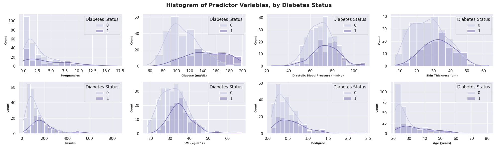
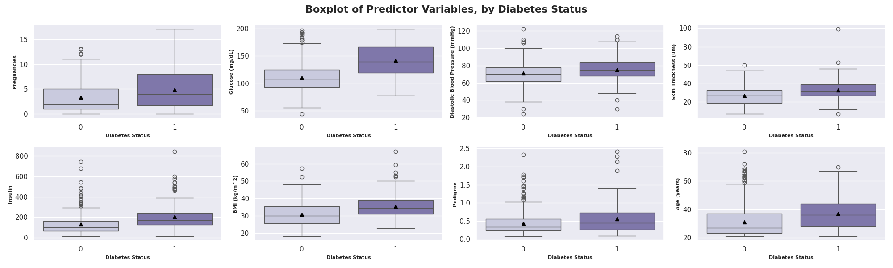
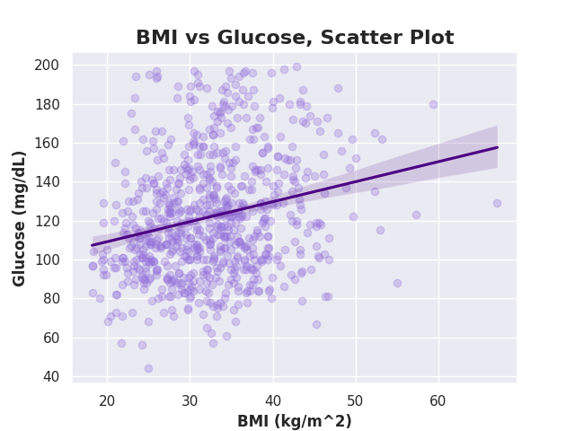
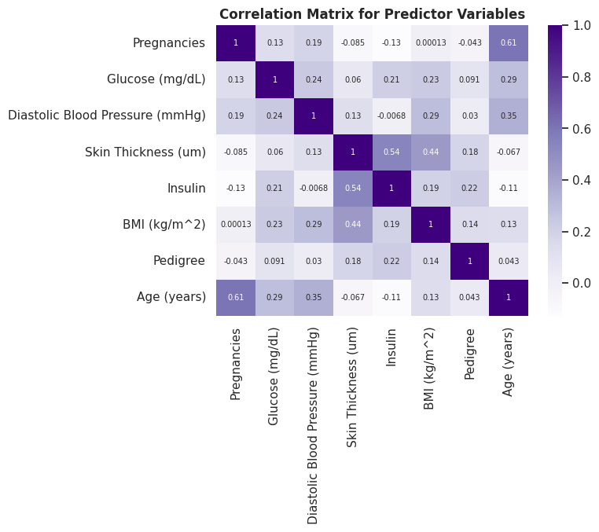

# Diabetes Risk Factor Analysis

Google Colab: https://colab.research.google.com/drive/1zwWdc6W9DOPHhgKNpbsmEG8QYVC9MrUf?usp=sharing

## Purpose

This notebooks examines how eight health measurements differ between patients based on diabetes status. Predictor variables include pregnancies, glucose, diastolic blood pressure, skin thickness, insulin, BMI, predigree, and age. The outcome is a binary diabetes status (0 = no diabetes, 1 = has diabetes).

Before the analysis, the data is cleaned, validated, and summarized.

Several measurements have values that are implausible (e.g., BMI < 0 or age > 150) or indicate a missing measurement (e.g., BMI = 0), so these values are set as NaN, per the predefined validity rules set in Section 6. In addition, duplicate observations are identified and removed, and data types are checked.

The analysis then proceeds to perform descriptive statistics for each predictor overall and by outcome group, visualization of the distributions between predictors and by outcome, and inferential analysis to identify whether each predictor differs between the two outcome groups.

## Repo Structure

```
Week 2/
├── README.md
├── diabetes_risk_factor_analysis.ipynb
├── data/
│   └── raw/
│       └── Example Dataset_Diabetes.csv
│   └── processed/
│       └── Dataset_Diabetes_Cleaned.csv
├── docs/
│   └── Week 2 - Reproducibility Exercise: Diabetes Risk Factor Analysis.pdf
└── outputs/
    └── figures/
        ├── predictor_histograms.png
        ├── predictor_boxplots.png
        ├── bmi_glucose_scatterplot.png
        └── correlation_heatmap.png
```

## Notebook Structure

- **1. Purpose and Overview**
- **2. Setup and Environment**
  - 2.1. Package Versions
  - 2.2. Import
  - 2.3. Environment Check
  - 2.4. Random Seed
  - 2.5. File Paths
- **3. Data Source and Provenance**
- **4. Data Loading**
  - 4.1. Reading Dataset
- **5. Data Validation and Review**
  - 5.1. Column Groups
  - 5.2. Structure
  - 5.3. Missing Values
  - 5.4. Duplicates
- **6. Data Preparation and Cleaning**
  - 6.1. Validity Rules
  - 6.2. Data Type Check
  - 6.3. Dropping Duplicates
  - 6.4. Save Cleaned Dataset
- **7. Analysis**
  - 7.1. Descriptive Statistics
    - 7.1.1. Overall Distributions
    - 7.1.2. Outcome Distribution
    - 7.1.3. Predictor Distributions
    - 7.1.4. Predictor Distributions by Outcome Group
    - 7.1.5. Mean and Standard Deviation Summary
  - 7.2. Visualizations
    - 7.2.1. Predictor Histograms by Diabetes Status
    - 7.2.2. Predictor Boxplots by Diabetes Status
    - 7.2.3. BMI vs Glucose Scatter Plot
    - 7.2.4. Correlation Matrix and Heatmap
  - 7.3. Inferential Analysis
    - 7.3.1. Student's t-test for Glucose
    - 7.3.2. Welch's t-tests Across All Predictors
  - 7.4. Data, Statistics, and the Machine Learning Workflow
- **8. Reproducibility Check**
- **9. Results and Conclusions**

## Data Source & Provenance

The data source is the Pima Indians Diabetes Dataset, which was originally collected by the National Institute of Diabetes and Digestive and Kidney Diseases. The dataset contains health measurements for 768 female patients and a binary target variable indicating whether each patient has diabetes.

Several measurements record 0 where no reading was taken (glucose, diastolic blood pressure, skin thickness, insulin, and BMI). This is a known characteristic of the dataset (https://search.r-project.org/CRAN/refmans/mlbench/html/PimaIndiansDiabetes.html), and those values are treated as missing in Section 6.

| Column | Description | Units | Type |
|---|---|---|---|
| `Pregnancies` | Number of times pregnant | count | Integer |
| `Glucose` | Plasma glucose concentration | mg/dL | Integer |
| `D_BP` | Diastolic blood pressure | mmHg | Integer |
| `Skin_Thickness` | Tricep skin fold thickness | mm | Integer |
| `Insulin` | 2-hour serum insulin | mmU/mL | Integer |
| `BMI` | Body Mass Index | kg/m^2 | Float |
| `Pedigree` | Diabetes pedigree function | unitless | Float |
| `Age` | Age | years | Integer |
| `Outcome` | Diabetes Status | 0 = No diabetes, 1 = Has diabetes | Integer |

## Required Software & Libraries

Google Colab. Package versions are defined in and installed by the notebook.

| | Version |
|---|---|
| `Python` | 3.13.15 (Colab runtime) |
| `pandas` | 2.2.3 |
| `numpy` | 2.1.3 |
| `matplotlib` | 3.10.0 |
| `scipy` | 1.16.3 |
| `seaborn` | 0.13.2 |

Standard libraries (`os`, `sys`, `platform`, `operator`, `urllib`, `pathlib`, `importlib.metadata`) are bundled with Python and are not installed separately.

## Setup & Installation Instructions

No local setup is required. Section 2.1 of the notebook installs the required package versions into the Colab runtime, and Section 2.3 checks that the running versions match. The Python version is set by Colab and cannot be installed.

The dataset is pulled from this repository automatically. To use a local copy instead, upload `Example Dataset_Diabetes.csv` to `/content` before running. If done, the notebook will detect and use it.

## Instructions for Executing Notebook

1. Open `diabetes_risk_factor_analysis.ipynb` in Google Colab using the link at the top of this README.
2. Select **Run all**.
3. The dataset is pulled from automatically from this repository, no additional setup or configuration is required. If uploading a local copy is preferred, upload `Example Dataset_Diabetes.csv` to `/content` before running.

The notebook uses a single random seed (`SEED = 123`) and produces the same output on every run.

## Expected Outputs

Outputs are written to `/content/outputs/` in the Colab environment; download them from the file browser before the session ends.

- `Dataset_Diabetes_Cleaned.csv`: Cleaned dataset, after checking for missingness, applying validity rules, and dropping duplicates.
- `figures/`: Output visualizations, including predictor histograms by diabetes status, predictor boxplots by diabetes status, BMI vs glucose scatter plot, and a correlation heatmap.
- Tables displayed in the notebook: descriptive statistics, group means and standard deviations, Spearman correlation matrix, t-test results

**Predictor Histograms by Diabetes Status:**



**Predictor Boxplots by Diabetes Status:**



**BMI vs Glucose Scatter Plot:**



**Correlation Heatmap:**



## Assumptions and Limitations

- Several measurements recorded 0 where no reading was taken. The reason these measurements were not collected or recorded is unknown and may be systematic, which could bias the results.
- Insulin (374 zeros / missing values) and skin thickness (227 zeros / missing values) were the most affeceted by missingness, reducing the sample size and limiting the robustness of the findings for these variables.
- The t-tests assume an approximate normality for each group, which may be violated for pregnancies, insulin, and pedigree which appear to be right skewed. A future analysis could include a non-parametric alternative (e.g., Mann-Whitney U) as an additional robustness check.
- The Student's t-test assumes equal variance between groups, which Welch's t-test does not.
- The cohort is female patients aged 21 and older, limiting generalizability to the broader population.

## Acknowledgements

Thanks to the National Institute of Diabetes and Digestive and Kidney Diseases of collecting the original data, Kaggle and the UC Irvine Machine Learning Repository for making it available, and the course for providing the copy used here.

## AI Use Statement

Generative AI (Claude) was used as a coding, learning, and editing assistant for the following:

- Python syntax and package questions (e.g., installing specific package versions in the Google Colab environment, loading data from a public repository, implementing Welchs t-test across all predictors)
- Brainstorming and editing notebook and README structure / contents, and learning reproducibility best practices
- Assistance brainstorming, identifying, editing, and interpreting visualizations, assumption violations / limitations, and t-test results

I verified and reviewed all work. I take full responsibility for the accuracy and legitimacy of all work submitted.

## Computational Environment Information

Google Colab:

```
Python implementation: CPython
Python version       : 3.13.15
IPython version      : 7.34.0

pandas    : 2.2.3
numpy     : 2.1.3
matplotlib: 3.10.0
scipy     : 1.16.3
seaborn   : 0.13.2

Compiler    : GCC 13.3.0
OS          : Linux
Release     : 6.6.122+
Machine     : x86_64
Processor   : x86_64
CPU cores   : 2
Architecture: 64bit
```

