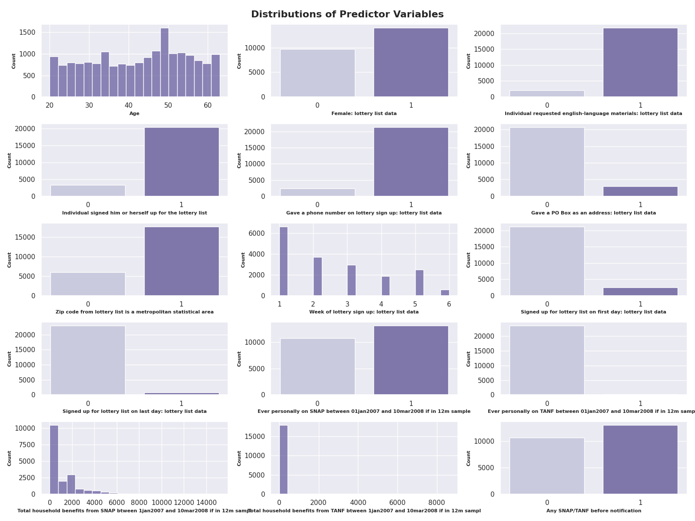
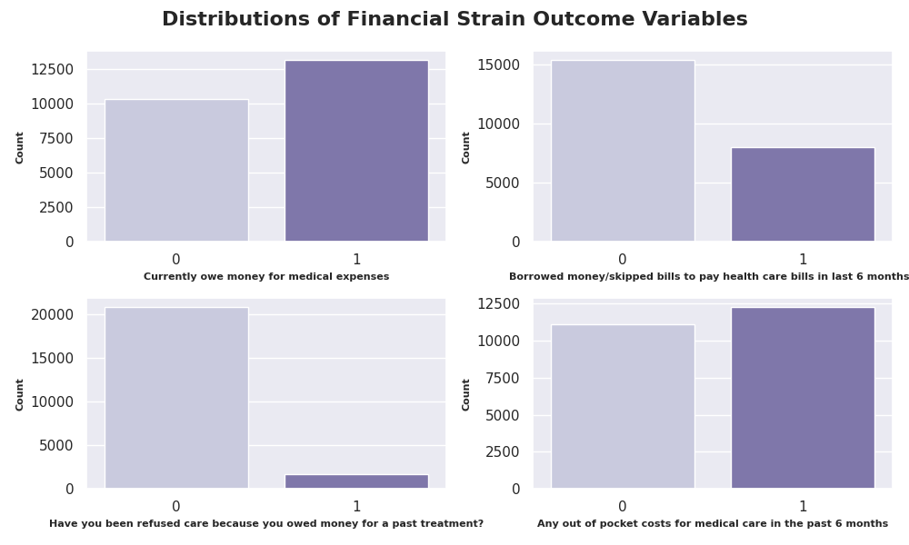
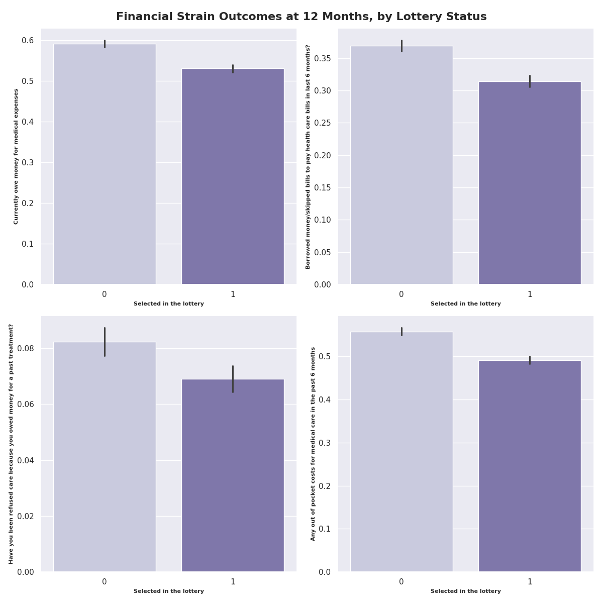
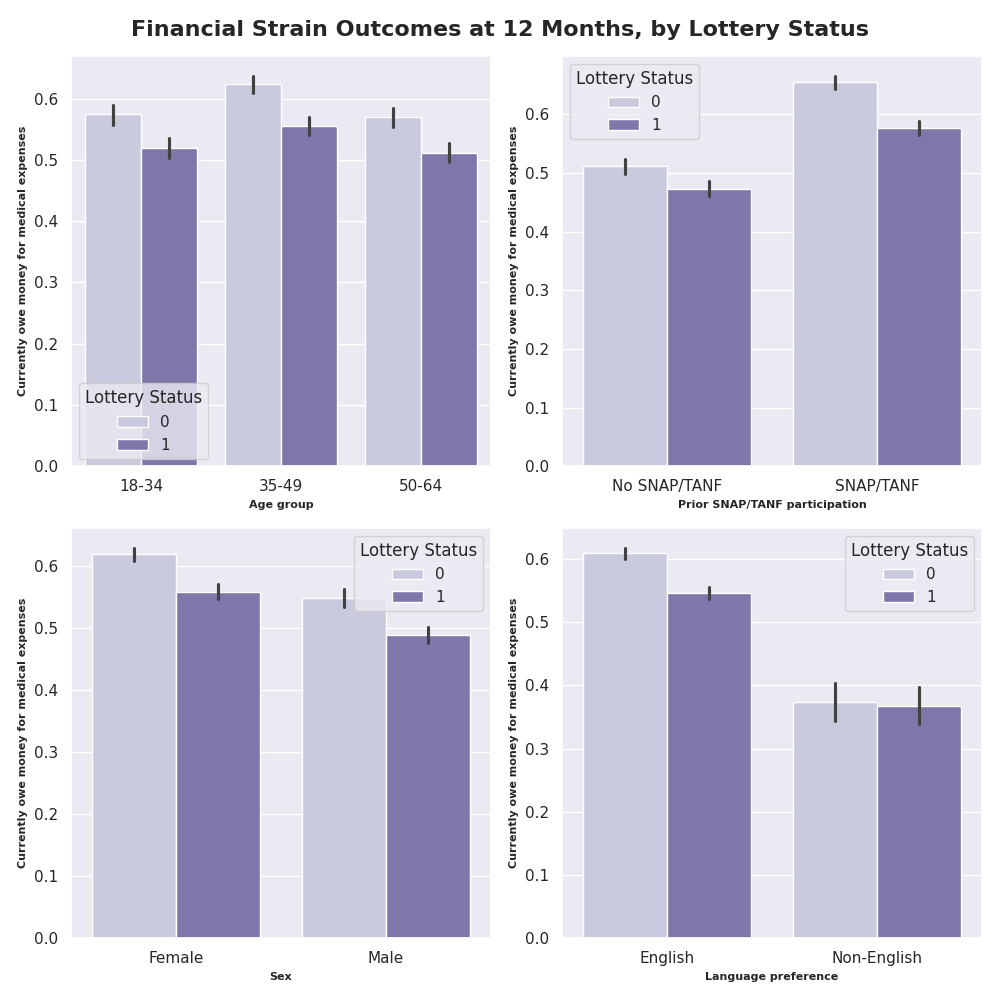
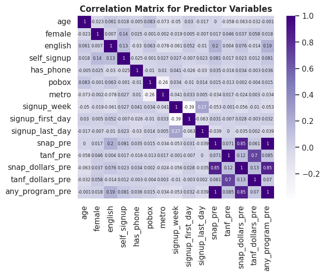

# Data Selection and Final Project Planning Lab

**Project Name:** Allocating Scarce Medicaid Coverage: A Counterfactual Comparison of Lottery, Need-Based, and Learned Targeting in the Oregon Health Insurance Experiment

**Google Colab:** https://colab.research.google.com/drive/18PLz4JU1gqyI56n-lp3NdDap5LiDeD9s?usp=sharing

**Author:** Chayce Reed

**Date:** 10/03/26

## Purpose

This notebook documents and examines the data selection, exploration, and quality assessment for a project on Medicaid coverage allocation using the Oregon Health Insurance Experiment (OHIE) Public Use Data.

It loads the NBER public-use files and merges the lottery, enrollment, and 12-month survey data into a single dataset. It also runs quality checks for duplicate person ids, missingness, invalid values, inappropriate data types, and restricts the sample to survey respondents. Finally, it provides and produces descriptive statistics and visualizations for the predictors and outcomes, including a correlation heatmap and outcome rates by treatment group.

## Repo Structure

```
Data Selection and Final Project Planning Lab/
├── README.md
├── data_selection_and_final_project_planning_lab.ipynb
└── outputs/
    └── figures/
        ├── predictor_distributions.png
        ├── outcome_distributions.png
        ├── outcome_distributions_by_lottery_status.png
        ├── outcome_distributions_by_subgroup.png
        └── predictor_correlation_heatmap.png
```

## Notebook Structure

- **1. Setup**
  - 1.1. Package Version Check & Installation
  - 1.2. Package Importing & Seed Setting
  - 1.3. File Path Creation & Locating Data
- **2. Data Loading & Merging**
  - 2.1. Data Loading
  - 2.2. Data Subsetting & Merging
  - 2.3. Variable Renaming & Labeling
  - 2.4. Derived Variables
  - 2.5. Data Subsetting & Variable Grouping
- **4. Data Structure & Loading**
  - 3.1. Data Structure, Type, & View
- **4. Data Checks & Cleaning**
  - 4.1. Data Checks Functions
  - 4.2. Data Checks
  - 4.3. Data Cleaning
- **5. Data Exploration & Visualization**
  - 5.1. Summary & Visualization Functions
  - 5.2. Descriptive Statistics
  - 5.3. Treatment Group Comparisons
  - 5.4. Distribution Visulizations
  - 5.5. Outcomes by Treatment Groups
  - 5.6. Subgroup Analysis
  - 5.7. Predictor Correlation Matrix & Heatmap

## Data Source & Provenance

**Data Source:** Oregon Health Insurance Experiment (OHIE) Public Use Dataset

**Data Access:** https://www.nber.org/research/data/oregon-health-insurance-experiment-data (Free registration, if prompted)

**Data Description:** "In 2008, a group of uninsured low-income adults in Oregon was selected by lottery to be given the chance
to apply for Medicaid. This lottery provides a unique opportunity to gauge the effects of expanding access
to public health insurance on the health care use, financial strain, and health of low-income adults using a
randomized controlled design. The Oregon Health Insurance Experiment followed and compared those
selected in the lottery (treatments) with those not selected (controls)."

**Data Files:** The dataset includes six separate datasets from the OHIE that have been made pubiicly available. For this project, the following datasets will be used: Descriptive Variables (oregonhie_descriptive_vars.dta), State Program Variables (oregonhie_stateprograms_vars.dta), and Tweleve Month Mail Survey (oregonhie_survey12m_vars.dta).

**Data Selection:** The OHIE dataset was selected for this project because it provides a unique opportunity to analyze the effects of Medicaid coverage on low-income adults in Oregon. The experiment's randomized "lottery" design allows for the comparison between those who were selected for Medicaid coverage and those who were not, making it a useful dataset for studying the impact of health insurance on various outcomes. This dataset also lines up directly with my research interests and goals. I am applying to PhD programs to study causal inference for health services, policy, and equity research, across two key areas: how health policy and health care delivery systems shape access for marginalized populations, and how automated decision-making produces and entrenches disparities in health care. This dataset and project fits squarely into the former, and will allow me to investigate how coverage decisions affect low-income, uninsured populations and how those decisions could be made more equitably. The data includes characteristics recorded before the lottery, which makes it possible to estimate the causal effect of a coverage offer, test whether the effect differs across subgroups, and simulate whether an alternative allocation rule (e.g., need-based, learned-targeting) would have prevented more medical debt than the lottery. This combination of causal inference, policy simulation, and equity analysis is the kind of work I am hoping to develop my future PhD research agenda around, which makes it a very exciting dataset and project to work on.

**Binary Classification:** Yes. The target whether the respondent owes money for medical expenses at 12 months (binary: 1 = yes, 0 = no).

**Observation Count:** 23,741 respondents to the 12-month survey, out of 74,922 total people on the original lottery list.

**Predictor Variable Count:** 15 predictor variables measured before the lottery, including: age, sex, english-language preference, self-signup, phone number provided, PO box addressed used, metro-area zip, signup week, first-day signup, last-day signup, prior SNAP participant, prior TANF participant, household SNAP dollars, household TANF dollars, and any-state program indicator.

## Data Quality Assessment

**Distribution of Predictor Variables:**



**Distributions of Financial Strain Outcome Variables:**



**Financial Strain Outcomes by Lottery Status:**



**Financial Strain Outcomes by Subgroup:**



**Predictor Correlation Heatmap:**



**Anticipated Preprocssing Steps:**

- Merge the three datasets (descriptive, state program, and 12-month survey) into a single dataset for analysis.
- Convert columns that loaded as an object datat type to the appropriate data type (e.g., categorical, numeric).
- Rename variables to shorter, more interpretable names.
- Restrict dataset to only include respondents who completed the 12-month survey.
- Derive age from birth year and survey date.
- Review data dictionary to verify if missing SNAP/TANF benefit dollar amounts should be set to 0 or treated as missing.
- Standardize continuous predictors (if appropriate, pending modeling approach, TBD).
- Apply survey weights (per the data dictionary and documentation) to ensure that the analysis is properly representative of the true population

**Potential Challenges with the Dataset:**

- Offers vs coverage: Winning the lottery gave people the chance to apply for Medicaid coverage, but doesnt guarentee they were enrolled. This means that the treatment group (selected in the lottery) may include people who were not actually covered by Medicaid. To address this challenge, we will conduct the primary analysis using intention-to-treat, with an additional secondary analysis for those who were actually enrolled in Medicaid coverage.
- Survey non-response: Only 23,741 of the 74,922 people on the original lottery list completed the 12-month survey. Respondents may differ systematically from non-respondents, which could bias the results. To address this challenge, we will apply survey weights per the documentation to help ensure the analysis is properly representative of the true population.
- Skewed SNAP/TANF benefit dollar amounts: Based on the data exploration and visualization, the SNAP and TANF benefit dollar amounts appeared to be highly skewed, with small number of respondents having very high amounts.
- 2008 Oregon Data: The data is from a 2008 Oregon-specific experiment, meaning that the results may not be generalizable to other states or time periods. Therefore, the findings should be framed carefully and not overstate modern implications.

## Project Planning

**Prediction Problem:**

- Binary classification: predict whether a low-income, uninsured adult will owe money for medical expenses 12 months after applying for Medicaid, and which variables are the most predictive of that outcome.
- Inputs are characteristics recorded at signup (e.g., age, sex, language preference, prior state program participation, etc), plus whether the person was selected in the lottery.
- This prediction problem and classifier is not the ultimate end goal, and it will feed into the causal analysis and policy simulation later on.
- Model Selection: TBD (currently thinking of running logistic regression, random forest, and XGBoost, and selecting the best performing as the final model).

**Causal Inference**

- Estimate the effect of being offered Medicaid on medical debt, with the lottery being the source of random assignment.
- Estimate the effect of actually enrolling.
- Check whether the effects differ across subgroups (e.g., age, sex, language preferance, prior SNAP/TANF participation)

**Policy Simulation**

- Ask what the total medical debt would have been if the same number of coverage offers had been allocated based on need (e.g., prior SNAP/TANF participation), instead of a lottery.
- Ask what the total medical debt would have been if everyone on the list had recieved a coverage offer, inestad of a lottery.
- Ask what the total medical debt would have been if the same number of coverage offers had been allocated based on the largest predicted benefit, instead of a lottery. (TBD, if time permits).
- Conduct a subgroup analysis to see which groups are most impacted by the allocation rule change.

**Target Variable:**

- The primary outcome variable is cost_any_owe_12m, defined as "Currently owe money for medical expenses" at the 12 month follow-up survey (binary: 1 = yes, 0 = no).
- Additional secondary outcomes include cost_borrow_12m, cost_refused_12m, and cost_any_oop_12m, which represent "Borrowed money/skipped bills to pay health care bills in last 6 months?", "Have you been refused care because you owed money for a past treatment?", "Any out of pocket costs for medical care in the past 6 months", respectively.
- Based on the analysis below, approximately 55% of all respondents reported having medical debt, 34% reported borrowing money or skipping bills to pay health care bills, 7% reported being refused care due to medical debt, and 52% reported out of pocket costs for medical care in the last 6 months. These variables will be used to evaluate the impact of Medicaid coverage on financial strain related to medical expenses.

**Candidate Evaluation Metrics:**

- AUC: For how well each model discriminates between those who owe money for medical expenses and those who do not.
- Brier Score: For how well each model predicts the probability of owing money for medical expenses.
- Calibration curves: For how closely predicted probabilities match observed outcome rates.
- Replication of Original Study: Ensure the causal analysis reproduces the same (or similar) results as the original study, before proceeding with the prediction model, counterfactual simulation, or subgroup analysis.
- Test Causal Methods Simulation against Simulated Dataset (TBD, if time permits): Build a test dataset with known truth, and run through the analysis pipeline to confirm the results are accurate.

## Required Software & Libraries

Google Colab. Package versions are defined in and installed by the notebook.

| | Version |
|---|---|
| `Python` | 3.13.15 (CPython, Colab runtime) |
| `pandas` | 2.2.3 |
| `numpy` | 2.1.3 |
| `scipy` | 1.16.3 |
| `matplotlib` | 3.10.0 |
| `seaborn` | 0.13.2 |
| `scikit-learn` | 1.6.1 |
| `statsmodels` | 0.15.0 |
| `pyreadstat` | 1.3.6 |
| `xgboost` | 3.4.1 |
| `linearmodels` | 7.0 |
| `econml` | 0.17.0 |
| `shap` | 0.52.0 |

Standard libraries (`sys`, `platform`, `subprocess`, `zipfile`, `operator`, `pathlib`, `importlib.metadata`) are bundled with Python and are not installed separately.

## Instructions for Setup & Execution of Notebook

1. Open the notebook in Google Colab.
2. Download the OHIE public-use data from NBER: https://www.nber.org/research/data/oregon-health-insurance-experiment-data. Registration is free. The file is `oregon_puf.zip`.
3. Run the notebook using `Run all`. The setup step will automatically install required packages. When the data location step runs, a "Choose Files" button appears below the cell; click it and select `oregon_puf.zip`. Alternatively, drag the zip into the Files panel (folder icon, left sidebar) before running, and the notebook will find automatically. The notebook will unzip the zip file and locate the appropriate `.dta` files automatically.

## Acknowledgements

The project uses the public-use data from the Oregon Health Insurance Experiment, made available by the National Bureau of Economic Research (NBER). 

Finkelstein, Amy. Oregon Health Insurance Experiment Public Use Data, 2013. Available at https://www.nber.org/research/data/oregon-health-insurance-experiment-data.

## AI Use Statement

Generative AI (Claude) was used as a coding, learning, and editing assistant for the following:

- Brainstorming dataset and project ideas, based on my research interests and background, and scoping the study design, such as including a combination of classification, causal inference, and policy simulation components.
- Python syntax and package questions, Colab environment setup (package version installing, file locating and extraction), organizing code into reusable functions, and debgugging code.

I verified and reviewed all work. I take full responsibility for the accuracy and legitimacy of all work submitted.

## Computational Environment Information

Google Colab:

```
Python implementation: CPython
Python version       : 3.13.15
IPython version      : 7.34.0

pandas      : 2.2.3
numpy       : 2.1.3
scipy       : 1.16.3
matplotlib  : 3.10.0
seaborn     : 0.13.2
sklearn     : 1.6.1
statsmodels : 0.15.0
pyreadstat  : 1.3.6
xgboost     : 3.4.1
linearmodels: 7.0
econml      : 0.17.0
shap        : 0.52.0

Compiler    : GCC 13.3.0
OS          : Linux
Release     : 6.6.122+
Machine     : x86_64
Processor   : x86_64
CPU cores   : 2
Architecture: 64bit
```

